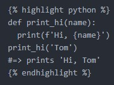

앞으로 Jekyll 블로그를 운영하기 때문에, Jekyll에 Markdown 형식의 글을 올리는 방법과, Markdown 형식의 글을 쓰는 방법에 대해 알아보았다.

1. Jekyll 블로그 운영하기
기본적으로 Jekyll 블로그에 제공되는, welcome-to-jekyll.markdown 파일을 번역해 보았다.

우선, 대부분의 글은 `_posts` 폴더에 위치한다. 그리고 모든 글의 양식은 다음과 같다. :

`YEAR-MONTH-DAY-title.md`

`YEAR`은 4자리의 정수, `MONTH`와 `DAY`는 두자리의 정수로 작성한다. 그 후에 적절한 제목을 작성한 뒤, 마크다운 확장자(.md)로 마무리한다.

Jekyll은 코드를 보여주는데 적합한 기능을 제공한다.


def print_hi(name):
  print(f'Hi, {name}')
print_hi('Tom')
#=> prints 'Hi, Tom'


이러한 형태로 작성한다.
